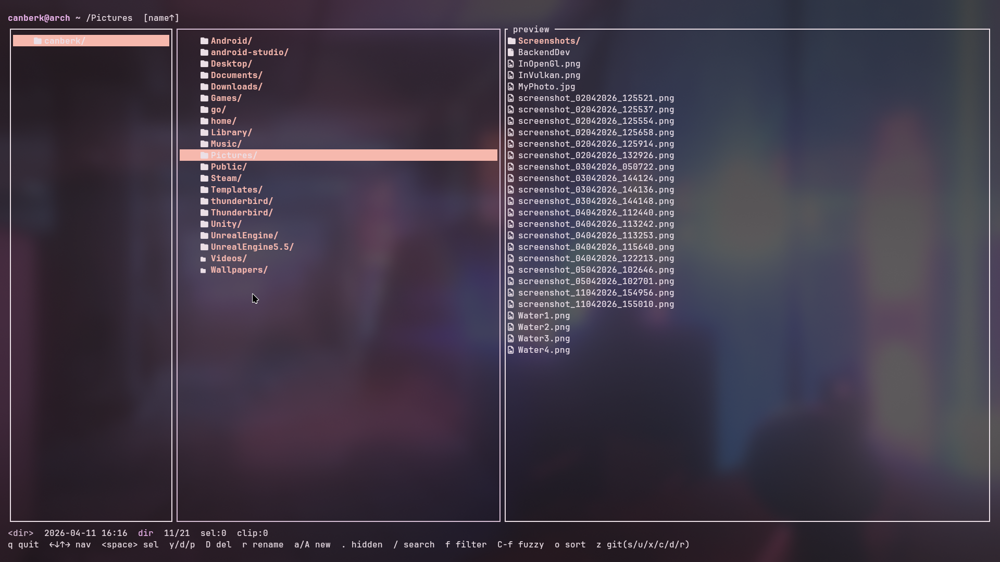
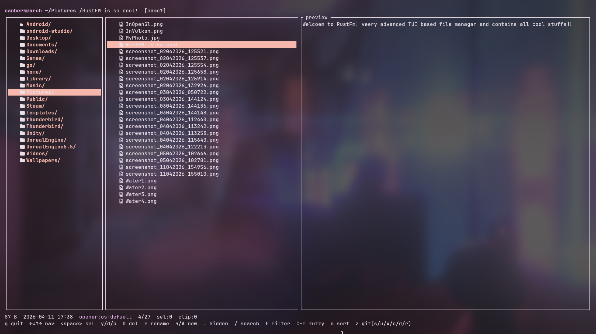
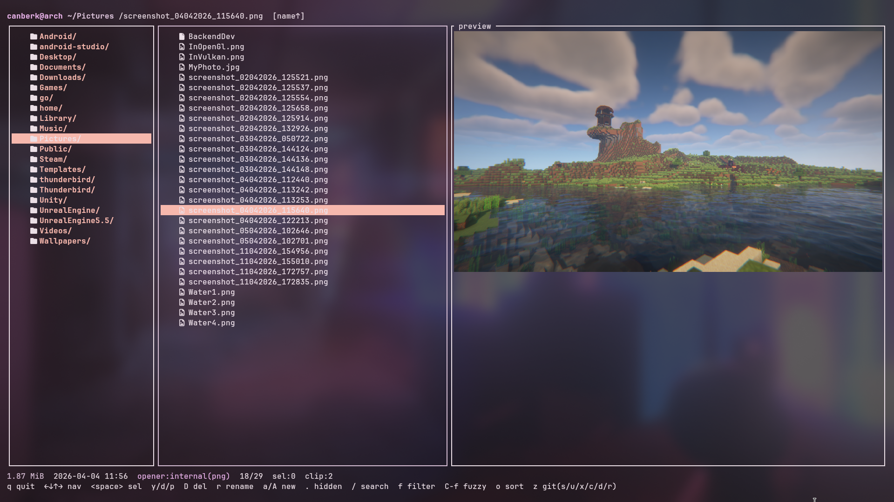

# Rustfm

A fast, modern terminal file manager written in Rust.

Rustfm is a keyboard-driven TUI file manager built around a three-pane Miller-column layout. It aims to be responsive on large directories, comfortable for everyday navigation, and flexible enough to replace a graphical file manager for users who live in the terminal. It targets developers, system administrators, and power users who want a single tool for browsing, previewing, and operating on files without leaving the shell.

## Screenshots







## Features

### Layout and previews
- **Three-pane Miller-column layout** showing parent directory, current directory, and a live preview of the selected entry.
- **Image previews** rendered directly in the terminal via the Kitty, iTerm2, or Sixel graphics protocols, with a halfblocks fallback so previews work on any terminal. Implemented on top of `ratatui-image`.
- **Text, directory, and binary previews** with automatic binary detection and MIME type information for unknown files.
- **Nerd Font icons** for folders, symlinks, and dozens of file types including Rust, Go, Python, JavaScript/TypeScript, HTML/CSS, Markdown, TOML, YAML, JSON, images, video, audio, archives, PDF, and office documents.

### Navigation and editing
- **Keyboard-driven navigation** using arrow keys and a compact vim-inspired command set: `gg`/`G`, `/`, `n`/`N`, `y`/`d`/`p`, `D`, `r`, `a`/`A`, `.`, `'`.
- **Per-directory cursor memory** — the cursor position is remembered when you leave and return to a directory.
- **Bookmarks** — press `'` followed by a key to jump to any path defined in `config.toml`.
- **Multi-selection** with `<space>`; yank, cut, and delete all operate on the current selection when one exists.
- **Hidden files toggle** via `.`.

### File operations
- **Background file operations** with a live progress bar. Copy, move, and delete run on a dedicated worker thread over mpsc channels so the UI never blocks. A progress gauge appears above the footer while a task is active.
- **Auto-unique destination on paste collisions** — pasting a file that already exists creates `name_1.ext`, `name_2.ext`, and so on.
- **Native trash support** via the `trash` crate, with direct-delete as a fallback. Toggleable through the `use_trash` config option.

### Discovery
- **Sort modes**: name, size, mtime, and extension, each with a reverse toggle. Triggered by `o` followed by `n`/`s`/`t`/`e`/`r`.
- **Live filter** (`f`) — type to narrow the current directory by substring match. Distinct from search.
- **Fuzzy finder overlay** (`Ctrl-F`) — centered popup with subsequence matching, scoring (consecutive-run, word-boundary, and start-of-string bonuses), and matched-character highlighting.
- **Rich git integration** — shows a two-character X/Y status column per entry (index + worktree) using `git status --branch --porcelain=v1 --ignored`, propagated up to parent directories so a folder is marked if any descendant has changed. The header bar displays the current branch, `↑ahead`/`↓behind` counts, staged/unstaged/untracked/conflict counters, and stash count. A `z`-prefixed menu drives stage, unstage, discard, commit, diff preview, and arbitrary `git` command execution without leaving the TUI. Colors are theme-driven.

### Opening files
- **Default application system** — Rustfm first consults an internal `[openers]` table in its config file, mapping file extension to a command template (with `{}` as the path placeholder). If no internal mapping exists for a file's extension, it falls back to the OS default handler: `xdg-open` on Linux, `open` on macOS, `start` on Windows. The status bar indicates which opener will be used, for example `opener:internal(rs)` versus `opener:os-default`.

### Appearance and configuration
- **Configurable theme** with 25 named colors covering borders, cursor, entry types, status, git indicators, progress bar, and overlays. Supports named colors and `#rrggbb` hex values.
- **TOML config** at `~/.config/rustfm/config.toml`, auto-generated with sensible defaults on first run.

## Installation

Build from source with Cargo:

```bash
git clone https://github.com/<your-user>/rustfm
cd rustfm
cargo build --release
```

The release binary will be at `target/release/rustfm`. Copy or symlink it somewhere on your `PATH`, for example:

```bash
install -m 755 target/release/rustfm ~/.local/bin/rustfm
```

A Nerd Font is required for the icon glyphs to render correctly in your terminal. Set your terminal font to any Nerd Font patched variant (for example `JetBrainsMono Nerd Font`, `FiraCode Nerd Font`).

## Usage

```bash
rustfm [PATH]
```

The positional `PATH` argument is optional and may be a directory or a file. If it is a directory, Rustfm starts there. If it is a file, Rustfm starts in its parent directory with the cursor on that file. When omitted, Rustfm starts in the current working directory.

## Keybindings

### Navigation
| Key | Action |
|-----|--------|
| `←` | Go to parent directory |
| `→` / `Enter` | Enter directory or open file |
| `↓` | Move cursor down |
| `↑` | Move cursor up |
| `Ctrl-d` / `Ctrl-u` | Page down / page up |
| `gg` | Jump to top |
| `G` | Jump to bottom |
| `'` `<key>` | Jump to bookmark |

### File operations
| Key | Action |
|-----|--------|
| `<space>` | Toggle selection on current entry |
| `y` | Yank (copy) selection or current entry |
| `d` | Cut selection or current entry |
| `p` | Paste into current directory |
| `D` | Delete (to trash, or hard-delete if `use_trash=false`) |
| `r` | Rename current entry |
| `a` | Create new entry — ending the name with `/` creates a directory, otherwise a file |

### Modes and overlays
| Key | Action |
|-----|--------|
| `/` | Search forward |
| `n` / `N` | Next / previous search match |
| `f` | Live filter |
| `Ctrl-F` | Fuzzy finder overlay |
| `o` `n`/`s`/`t`/`e` | Sort by name / size / mtime / extension |
| `o r` | Reverse sort |

### Selection
| Key | Action |
|-----|--------|
| `<space>` | Toggle selection and move down |
| `Ctrl-<space>` | Toggle selection without moving |
| `Shift-↑` / `Shift-↓` | Range select from anchor |
| `Ctrl-a` | Select all entries in current directory |
| `Esc` | Clear selection (or clear active filter) |

### Shell
| Key | Action |
|-----|--------|
| `!` | Ad-hoc shell prompt — type a command, run in the current directory |
| `,` `<key>` | Run a shell command bound to `<key>` in the `[commands]` table |

### Git (`z`-prefix menu)
| Key | Action |
|-----|--------|
| `z s` | Stage selection or current entry (`git add`) |
| `z u` | Unstage selection or current entry (`git restore --staged`) |
| `z x` | Discard worktree changes (`git restore`) |
| `z c` | Commit staged changes — opens a commit-message prompt |
| `z d` | Toggle diff preview — dirty tracked files show a colored unified diff in the preview pane |
| `z r` | Refresh git state |
| `z g` / `z :` | Run an arbitrary `git` command — opens a `git:` prompt; output is shown in the preview pane |

### Miscellaneous
| Key | Action |
|-----|--------|
| `.` | Toggle hidden files |
| `q` | Quit |

## Configuration

Rustfm reads its configuration from `~/.config/rustfm/config.toml`. On first launch the file is created with sensible defaults.

### Openers

The `[openers]` table maps file extensions to command templates. `{}` is replaced with the absolute path of the file. Rustfm first consults this table; if the file's extension has no match, it falls back to the OS default handler (`xdg-open` on Linux, `open` on macOS, `start` on Windows).

```toml
[openers]
rs   = "nvim {}"
toml = "nvim {}"
md   = "nvim {}"
py   = "nvim {}"
js   = "nvim {}"
ts   = "nvim {}"
html = "nvim {}"
css  = "nvim {}"
json = "nvim {}"
yaml = "nvim {}"
txt  = "nvim {}"

# Files with extensions not listed above are passed to xdg-open / open / start.
```

The default generated config uses `nvim` for text and code files. Change any entry to your editor of choice, or remove it to let the OS default handler take over.

### Bookmarks

```toml
[bookmarks]
h = "/home/you"
d = "/home/you/Downloads"
p = "/home/you/Desktop/Projects"
c = "/home/you/.config"
```

Press `'` followed by the bookmark key to jump.

### Commands

```toml
[commands]
e = "nvim {f}"
g = "lazygit"
t = "htop"
```

Press `,` followed by the key to run. See **Shell commands** below for placeholder semantics.

### Theme

```toml
[theme]
border           = "#3b4252"
border_active    = "#88c0d0"
cursor_bg        = "#4c566a"
cursor_fg        = "#eceff4"
dir_fg           = "#81a1c1"
file_fg          = "#d8dee9"
symlink_fg       = "#b48ead"
exec_fg          = "#a3be8c"
status_fg        = "#e5e9f0"
git_modified     = "#ebcb8b"
git_added        = "#a3be8c"
git_deleted      = "#bf616a"
git_untracked    = "#d08770"
progress_fg      = "#88c0d0"
overlay_bg       = "#2e3440"
```

All 25 theme keys accept either named colors (`"red"`, `"cyan"`, ...) or `#rrggbb` hex values.

### Other options

```toml
use_trash = true   # false = permanent delete on `D`
show_hidden = false
```

## Shell commands

Rustfm can run arbitrary shell commands in the current directory without dropping back to a real terminal. The TUI is suspended (leaves the alternate screen, disables raw mode), the command runs with stdin/stdout/stderr attached to the real terminal, and after it exits Rustfm prints `[press any key to return]` before restoring the TUI. This makes it work correctly for both interactive programs (e.g. `nvim`, `htop`, `lazygit`, `python`) and one-shot commands whose output you want to read (e.g. `ls -la`, `cargo build`, `rg foo`).

### Ad-hoc commands

Press `!` to open a `$` prompt, type any shell command, and press `Enter`. The command runs via `sh -c` in the current directory.

### Key-bound commands

The `[commands]` table in `config.toml` maps single-character keys to command templates. Press `,` followed by the bound key to run the command. Placeholders are substituted before execution and all paths are shell-quoted:

| Placeholder | Replaced with |
|-------------|---------------|
| `{f}` | Absolute path of the entry under the cursor |
| `{n}` | Base name of the entry under the cursor |
| `{d}` | Absolute path of the current directory |
| `{s}` | Space-joined selection (or `{f}` if no selection is active) |

Example:

```toml
[commands]
e = "nvim {f}"          # ,e — open current file in nvim
g = "lazygit"           # ,g — launch lazygit in cwd
t = "htop"              # ,t — launch htop
b = "cargo build"       # ,b — build the project under the cursor's dir
r = "rg --color=always {s}"   # ,r — ripgrep selection
```

After the command exits, Rustfm refreshes the directory and git state so any changes are reflected immediately.

## Git workflow

When the current directory is inside a git repository, Rustfm automatically picks up the repo root and keeps a live model of its state. No extra configuration is required beyond having `git` on `PATH`.

### Status column

Every entry shows a two-character `XY` column immediately after the selection marker:

- **X** — the index (staged) state
- **Y** — the worktree (unstaged) state

Each slot uses the same codes as `git status --porcelain`: ` ` clean, `M` modified, `A` added, `D` deleted, `R` renamed, `C` copied, `U` conflict, `?` untracked, `!` ignored. Directory rows inherit the most severe state of any descendant, so a folder is marked if anything inside it is dirty. Colors come from the theme keys `git_modified`, `git_added`, `git_deleted`, `git_untracked`, and `git_ignored`.

### Header badges

When inside a repo the top bar adds, after the path:

```
⎇ main ↑2 ↓1 ●3 ✚5 ?2 ‼1 ⚑1 [diff]
```

| Badge | Meaning |
|-------|---------|
| `⎇ <branch>` | Current branch (or `HEAD` when detached) |
| `↑N` | Commits ahead of upstream |
| `↓N` | Commits behind upstream |
| `●N` | Staged files |
| `✚N` | Unstaged (modified in worktree) files |
| `?N` | Untracked files |
| `‼N` | Files with merge conflicts |
| `⚑N` | Stash entries |
| `[diff]` | Diff preview mode is active |

### Actions

All git operations are reached via the `z` prefix menu. After pressing `z`, the next key selects the action:

- `z s` — **stage** the current entry, or the entire selection if one exists
- `z u` — **unstage**
- `z x` — **discard** worktree changes (equivalent to `git restore`)
- `z c` — **commit**: opens a single-line prompt for the commit message; pressing `Enter` runs `git commit -m`
- `z d` — **toggle diff preview**: when on, moving the cursor onto a dirty tracked file renders a colored unified diff (additions in `git_added`, deletions in `git_deleted`, hunks in the accent color)
- `z r` — **refresh** the cached git state
- `z g` (or `z :`) — **run any git command** from the repo root: opens a `git:` prompt where you can type e.g. `log --oneline -20`, `fetch origin`, `branch -a`, `diff --stat`, `stash list`. Rustfm executes `git -C <repo-root> <your args>` and dumps stdout and stderr into the preview pane. The repo state is refreshed automatically afterward so header badges and the status column update.

Actions operate on the multi-selection when one is active; otherwise they act on the entry under the cursor. The status bar confirms success or surfaces the first line of any git error.

## Requirements

- **Rust 1.75+** recommended for building from source.
- **Linux, macOS, or Windows.** Unix platforms are the primary target; Windows is supported on a best-effort basis.
- **`git` binary on `PATH`** for git status integration (optional).
- **A Nerd Font** terminal font for icon glyphs (optional but recommended).
- **`xdg-open` (Linux) / `open` (macOS) / `start` (Windows)** for opening files that have no internal opener mapping (optional).

## Project structure

```
src/
  main.rs         Entry point; CLI parsing, terminal setup and teardown.
  app.rs          Core application state, pane model, selection, cursor memory.
  config.rs       TOML config loading, defaults, openers and bookmarks.
  events.rs       Main event loop and key dispatch.
  fs_ops.rs       Copy, move, delete, rename, create primitives.
  opener.rs       Internal opener lookup and OS-default fallback.
  preview.rs      Text, directory, binary, and image preview builders.
  ui.rs           Ratatui rendering: three panes, icons, status, overlays.
  theme.rs        Theme struct, color parsing, defaults.
  background.rs   Worker thread, mpsc channels, progress reporting.
  git.rs          Git status parsing and propagation to parent folders.
  fuzzy.rs        Subsequence matcher, scoring, match highlighting.
```

## License

Rustfm is released under the MIT License. See `Cargo.toml` for the declaration.

## Contributing

Issues and pull requests are welcome. If you plan a larger change, please open an issue first to discuss the approach. Bug reports are most useful when they include the terminal emulator, font, and a minimal reproduction.
